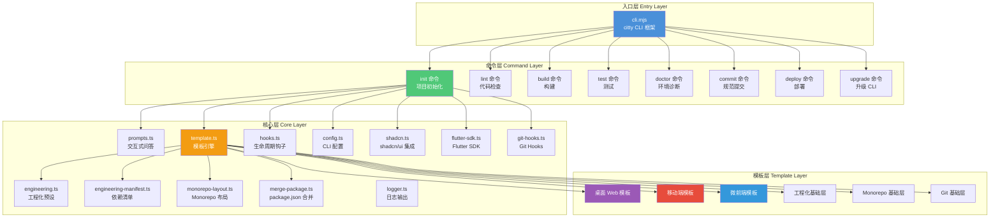
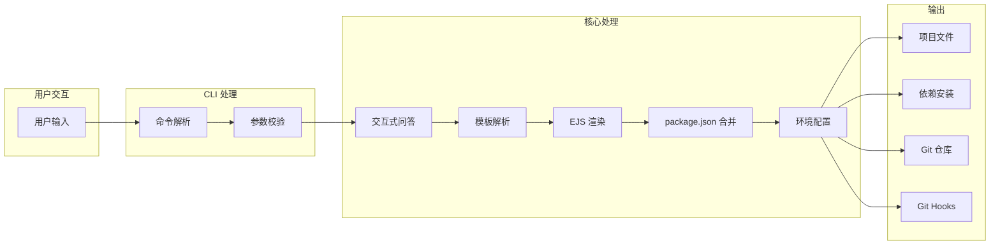
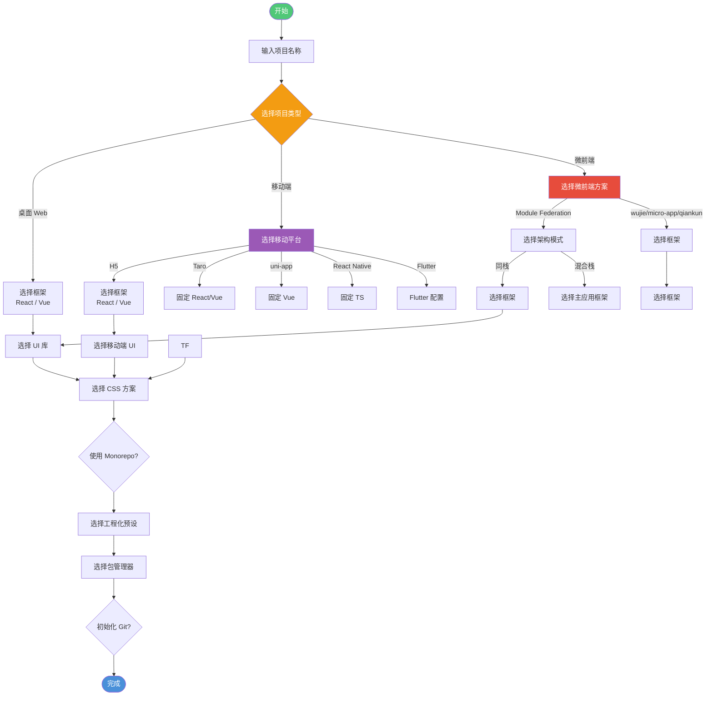
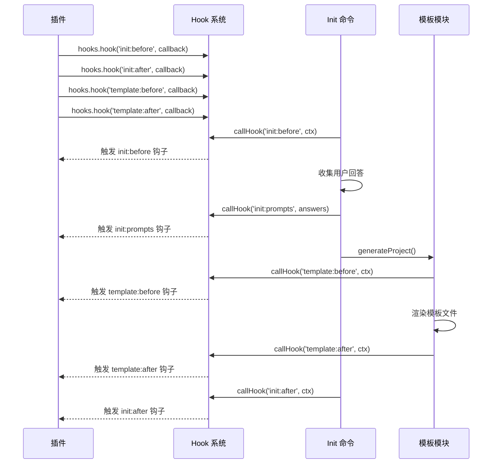
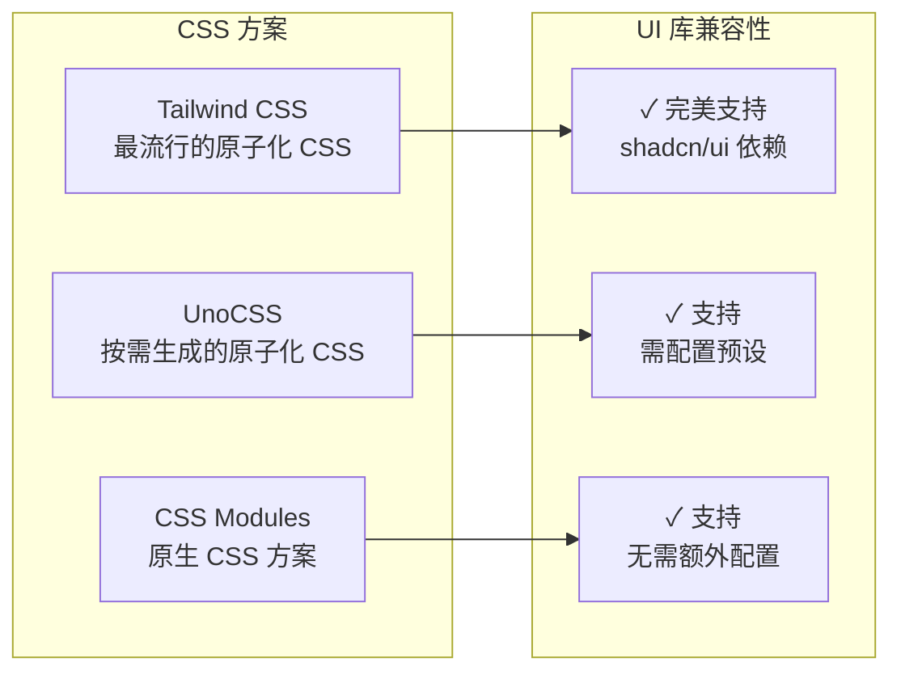
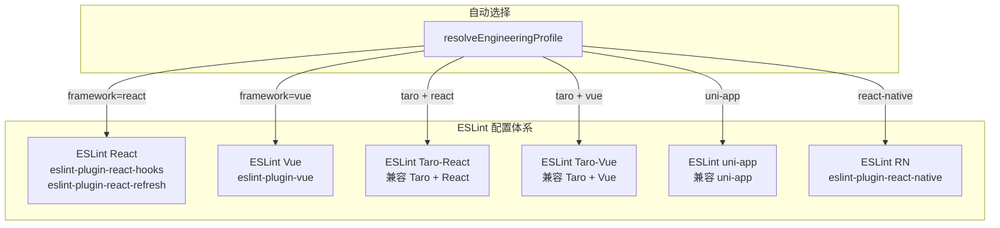
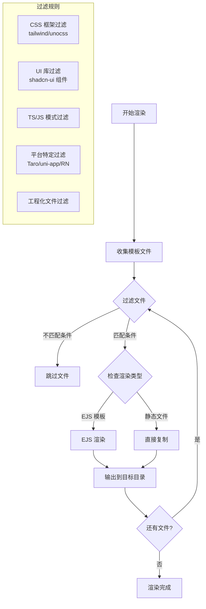
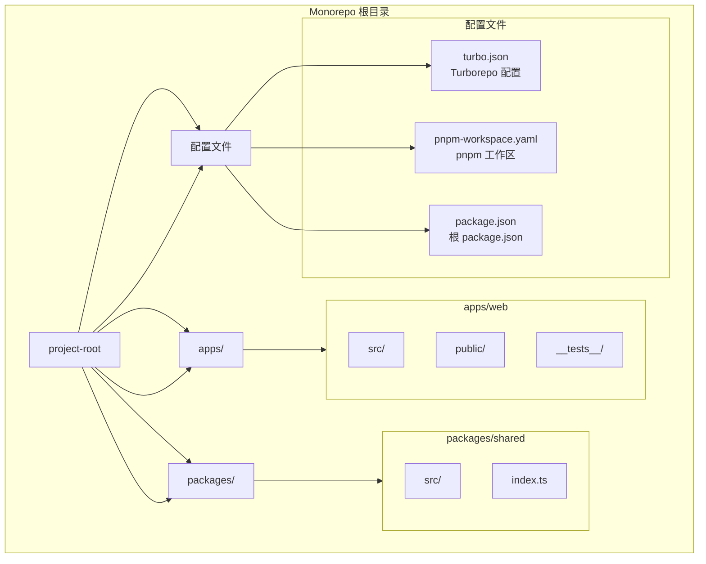
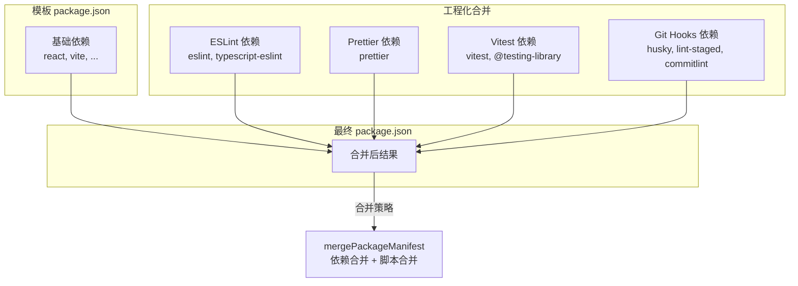
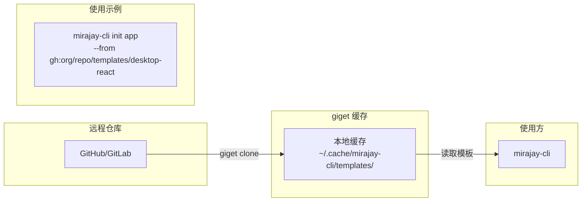

# mirajay-cli：企业级前端脚手架的架构设计与工程实践

> 一个覆盖桌面 Web、移动端与微前端全场景的企业级前端脚手架，基于 unjs 生态构建，集成 Turborepo、tsup、markdownlint 等工程化工具，为前端团队提供开箱即用的项目模板生成与工程化配置。

## 目录

- [一、引言：为什么需要企业级脚手架](#一引言为什么需要企业级脚手架)
- [二、整体架构设计](#二整体架构设计)
- [三、核心模块详解](#三核心模块详解)
- [四、全场景支持矩阵](#四全场景支持矩阵)
- [五、工程化预设体系](#五工程化预设体系)
- [六、模板引擎与动态渲染](#六模板引擎与动态渲染)
- [七、Monorepo 工程化集成](#七monorepo-工程化集成)
- [八、插件体系与扩展点](#八插件体系与扩展点)
- [九、实战示例：创建一个微前端项目](#九实战示例创建一个微前端项目)
- [十、总结与展望](#十总结与展望)

---

## 一、引言：为什么需要企业级脚手架

在现代前端开发中，脚手架（Scaffold/CLI Tool）已经成为每个团队不可或缺的基础设施。一个优秀的脚手架不仅能够快速生成项目模板，更能够统一团队的技术栈选择、工程化规范和开发流程。

### 传统脚手架的痛点

| 痛点 | 描述 |
|------|------|
| 场景单一 | 仅支持桌面 Web，无法覆盖移动端和微前端 |
| 配置冗余 | 生成的模板包含大量用不到的配置和依赖 |
| 技术栈耦合 | 切换框架（React/Vue）或平台成本高 |
| 工程化薄弱 | 缺乏完善的 Lint、测试、Git Hooks 集成 |
| 扩展困难 | 自定义模板和插件扩展机制不完善 |

### mirajay-cli 的设计理念

mirajay-cli 致力于解决上述痛点，其核心理念可概括为：

> **全场景覆盖 · 工程化优先 · 可扩展架构 · 动态模板**

```
┌─────────────────────────────────────────────────────────────┐
│                    mirajay-cli 架构理念                      │
├─────────────┬─────────────┬─────────────┬───────────────────┤
│  全场景覆盖  │  工程化优先  │  可扩展架构  │  动态模板渲染     │
├─────────────┼─────────────┼─────────────┼───────────────────┤
│ 桌面 Web    │ ESLint      │ Hookable   │ EJS 模板引擎      │
│ 移动端      │ Prettier    │ 插件体系    │ 条件渲染          │
│ 微前端      │ Stylelint   │ 远程模板    │ 多框架适配        │
│ Monorepo    │ Vitest      │ CLI 配置    │ 工程化合并层      │
└─────────────┴─────────────┴─────────────┴───────────────────┘
```

---

## 二、整体架构设计

mirajay-cli 采用经典的分层架构设计，从命令入口到核心逻辑再到模板渲染，每一层都职责清晰、松耦合、易扩展。

### 架构分层图



### 数据流示意图



---

## 三、核心模块详解

### 3.1 命令系统（Commands）

mirajay-cli 基于 **citty**（unjs 生态的 CLI 框架）构建，提供类型安全的命令定义方式。

```typescript
// src/index.ts - 命令注册示例
const main = defineCommand({
  meta: {
    name: 'mirajay-cli',
    version: '1.0.0',
    description: '企业级前端脚手架',
  },
  subCommands: {
    init,       // 初始化项目
    create: init, // create 是 init 的别名
    lint,       // 代码检查
    build,      // 构建
    doctor,     // 环境诊断
    test,       // 测试
    commit,     // 规范化提交
    deploy,     // CI/CD 部署
    upgrade,    // 升级 CLI
    'update-deps': updateDeps, // 更新模板依赖
  },
  run() {
    banner()
    console.log('使用 mirajay-cli --help 查看可用命令')
  },
})
```

### 3.2 交互式问答系统（Prompts）

基于 `@inquirer/prompts` 实现的动态问答系统，根据用户的选择智能调整后续问题。

**交互流程示意图**：



### 3.3 模板解析与选择逻辑

模板名称的解析是脚手架的核心逻辑之一，它根据用户的回答动态选择合适的模板。

```typescript
// src/core/template.ts - 模板名称解析
export function resolveTemplateName(answers: ProjectAnswers): string {
  const { projectType, framework, mobilePlatform, microFrontendTool } = answers

  // 桌面 Web
  if (projectType === 'desktop') {
    return framework === 'vue' ? 'desktop-vue' : 'desktop-react'
  }

  // 移动端
  if (projectType === 'mobile') {
    switch (mobilePlatform) {
      case 'h5':
        return framework === 'vue' ? 'mobile-h5-vue' : 'mobile-h5-react'
      case 'taro':
        return 'mobile-taro'
      case 'uni-app':
        return 'mobile-uni-app'
      case 'react-native':
        return 'mobile-rn'
      case 'flutter':
        return 'mobile-flutter'
    }
  }

  // 微前端
  if (projectType === 'micro-frontend' && microFrontendTool) {
    return resolveMicroFrontendTemplateName(microFrontendTool, answers)
  }
}
```

### 3.4 插件体系与 Hook 机制

基于 **hookable** 实现的生命周期钩子系统，支持插件扩展和自定义行为。

**Hook 生命周期图**：



**支持的 Hook 列表**：

| Hook 名称 | 触发时机 | 参数 |
|-----------|---------|------|
| `init:before` | 项目初始化开始前 | `{ projectName, targetDir, answers }` |
| `init:prompts` | 用户回答收集后 | `answers` |
| `init:after` | 项目初始化完成后 | `{ projectName, targetDir, answers }` |
| `template:before` | 模板渲染前 | `{ templateName, targetDir, answers }` |
| `template:after` | 模板渲染后 | `{ templateName, targetDir, answers }` |
| `lint:before` | Lint 执行前 | 无 |
| `lint:after` | Lint 执行后 | 无 |
| `build:before` | 构建执行前 | 无 |
| `build:after` | 构建执行后 | 无 |

---

## 四、全场景支持矩阵

### 4.1 项目类型支持

mirajay-cli 的核心优势之一是覆盖了前端开发的三大场景：

```
┌───────────────────────────────────────────────────────────────────────────┐
│                        mirajay-cli 全场景支持矩阵                         │
├──────────────┬──────────────┬──────────────┬────────────────────────────────┤
│   场景       │   框架       │   方案       │  模板                          │
├──────────────┼──────────────┼──────────────┼────────────────────────────────┤
│ 桌面 Web     │ React 19    │ SPA + Vite   │ desktop-react                  │
│              │ Vue 3       │ SPA + Vite   │ desktop-vue                    │
├──────────────┼──────────────┼──────────────┼────────────────────────────────┤
│ 移动端 H5    │ React       │ Vant UI      │ mobile-h5-react                │
│              │ Vue         │ Antd Mobile  │ mobile-h5-vue                  │
├──────────────┼──────────────┼──────────────┼────────────────────────────────┤
│ 跨端框架     │ Taro        │ React/Vue    │ mobile-taro                    │
│              │ uni-app     │ Vue          │ mobile-uni-app                 │
├──────────────┼──────────────┼──────────────┼────────────────────────────────┤
│ 原生移动     │ React Native│ Expo Router  │ mobile-rn                      │
│              │ Flutter     │ 多状态管理    │ mobile-flutter                 │
├──────────────┼──────────────┼──────────────┼────────────────────────────────┤
│ 微前端       │ Module Fed. │ 同栈/混合栈   │ micro-module-federation-*      │
│              │ wujie       │ React/Vue    │ micro-wujie-*                  │
│              │ micro-app   │ React/Vue    │ micro-micro-app-*              │
│              │ qiankun     │ React/Vue    │ micro-qiankun-*                │
└──────────────┴──────────────┴──────────────┴────────────────────────────────┘
```

### 4.2 UI 组件库支持

**Vue 生态**：

| UI 库 | 描述 | 适用场景 |
|-------|------|---------|
| Element Plus | 最流行的 Vue3 组件库 | 后台管理系统 |
| Ant Design Vue | Ant Design 的 Vue 实现 | 企业级应用 |
| Naive UI | 类型安全、主题定制 | 中后台系统 |
| Vuetify | Material Design 风格 | 快速原型 |
| PrimeVue | 丰富的 UI 套件 | 企业级应用 |
| Vant | 移动端首选 | H5 移动应用 |
| NutUI | 京东出品 | H5 移动应用 |
| uni-ui | DCloud 官方 | uni-app 跨端 |

**React 生态**：

| UI 库 | 描述 | 适用场景 |
|-------|------|---------|
| Ant Design | 最流行的 React 组件库 | 后台管理系统 |
| MUI | Material UI | 企业级应用 |
| NextUI | 现代化 UI | 中后台系统 |
| shadcn/ui | 可定制、开源 | 品牌定制项目 |
| Mantine | 轻量、可定制 | 快速开发 |
| Chakra UI | 无障碍、响应式 | 通用应用 |
| Antd Mobile | 移动端 | H5 移动应用 |
| React Vant | Vant 的 React 版本 | H5 移动应用 |

### 4.3 CSS 方案支持



---

## 五、工程化预设体系

### 5.1 预设配置对比

mirajay-cli 提供了三种预设级别和一种自定义模式：

```
┌─────────────────────────────────────────────────────────────────────────────┐
│                        工程化预设对比                                       │
├────────────────┬────────────┬────────────┬────────────┬──────────────────────┤
│  工具          │  Minimal   │  Standard  │  Strict    │  Custom              │
├────────────────┼────────────┼────────────┼────────────┼──────────────────────┤
│ ESLint         │ ✓         │ ✓         │ ✓         │ 可选                 │
│ Prettier       │ ✓         │ ✓         │ ✓         │ 可选                 │
│ Stylelint      │ ✗         │ ✓         │ ✓         │ 可选                 │
│ markdownlint   │ ✗         │ ✓         │ ✓         │ 可选                 │
│ cspell         │ ✗         │ ✗         │ ✓         │ 可选                 │
│ Vitest         │ ✗         │ ✓         │ ✓         │ 可选                 │
│ commitlint     │ ✗         │ ✓         │ ✓         │ 可选                 │
│ husky          │ ✗         │ ✓         │ ✓         │ 可选                 │
│ lint-staged    │ ✗         │ ✓         │ ✓         │ 可选                 │
└────────────────┴────────────┴────────────┴────────────┴──────────────────────┘
```

### 5.2 预设定义代码

```typescript
// src/core/engineering-manifest.ts
export const PRESET_DEFINITIONS = {
  minimal: {
    eslint: true,
    prettier: true,
    stylelint: false,
    markdownlint: false,
    spellcheck: false,
    vitest: false,
    commitlint: false,
    husky: false,
    lintStaged: false,
  },
  standard: {
    eslint: true,
    prettier: true,
    stylelint: true,
    markdownlint: true,
    spellcheck: false,
    vitest: true,
    commitlint: true,
    husky: true,
    lintStaged: true,
  },
  strict: {
    eslint: true,
    prettier: true,
    stylelint: true,
    markdownlint: true,
    spellcheck: true,
    vitest: true,
    commitlint: true,
    husky: true,
    lintStaged: true,
  },
}
```

### 5.3 多平台 ESLint 配置

mirajay-cli 根据不同平台提供了独立的 ESLint 配置：



---

## 六、模板引擎与动态渲染

### 6.1 EJS 模板渲染流程

mirajay-cli 使用 **EJS** 作为模板引擎，实现动态文件生成：



### 6.2 文件过滤策略

```typescript
// src/core/template.ts - 文件过滤逻辑
function shouldSkipEngineeringFile(
  relativePath: string,
  answers: ProjectAnswers,
  engineering: EngineeringOptions,
): boolean {
  // ESLint 过滤：根据 profile 选择对应平台配置
  if (relativePath.includes('eslint.') && engineering.eslint) {
    if (!profile || !matchesEslintProfile(relativePath, profile)) return true
  }
  
  // Vitest 过滤：根据框架选择测试配置
  if (relativePath.includes('vitest.config.') && !engineering.vitest) return true
  
  // Stylelint 过滤：根据框架选择样式检查配置
  if (relativePath.includes('stylelint.') && !engineering.stylelint) return true
  
  // ... 更多过滤规则
}
```

### 6.3 模板目录结构

```
templates/
├── desktop-react/          # React 桌面 Web 模板
├── desktop-vue/            # Vue 桌面 Web 模板
├── mobile-h5-react/        # H5 React 模板
├── mobile-h5-vue/          # H5 Vue 模板
├── mobile-taro/            # Taro 跨端模板
├── mobile-uni-app/         # uni-app 跨端模板
├── mobile-rn/              # React Native 模板
├── mobile-flutter/         # Flutter 模板
├── micro-module-federation-react/      # MF React 同栈
├── micro-module-federation-vue/        # MF Vue 同栈
├── micro-module-federation-mixed-*/    # MF 混合栈
├── micro-wujie-react/      # wujie React
├── micro-wujie-vue/        # wujie Vue
├── micro-micro-app-react/  # micro-app React
├── micro-micro-app-vue/    # micro-app Vue
├── micro-qiankun-react/    # qiankun React
├── micro-qiankun-vue/      # qiankun Vue
├── monorepo-base/          # Monorepo 基础配置
├── engineering-base/       # 工程化基础配置
└── git-base/               # Git 基础配置
```

---

## 七、Monorepo 工程化集成

### 7.1 Monorepo 布局



### 7.2 Monorepo 条件判断

```typescript
// src/core/monorepo-layout.ts
export function shouldUseMonorepoLayout(
  answers: ProjectAnswers,
  templateName: string,
): boolean {
  // 微前端模板（以 micro- 开头）已有自己的 Monorepo 结构
  return Boolean(answers.useMonorepo) && !templateName.startsWith('micro-')
}

export function resolveAppTargetDir(
  targetDir: string,
  answers: ProjectAnswers,
  templateName: string,
): string {
  if (shouldUseMonorepoLayout(answers, templateName)) {
    return join(targetDir, 'apps/web')  // Monorepo 模式
  }
  return targetDir  // 单包模式
}
```

### 7.3 package.json 合并策略



---

## 八、插件体系与扩展点

### 8.1 CLI 配置扩展

通过 `.clirc.ts` 文件自定义脚手架行为：

```typescript
// .clirc.ts 示例配置
export default {
  // 自定义模板目录
  templatesDir: './custom-templates',
  
  // 默认包管理器
  defaultPackageManager: 'pnpm',
  
  // 默认工程化预设
  defaultEngineeringPreset: 'standard',
  
  // 远程模板映射
  remoteTemplates: {
    'enterprise-admin': 'gh:company/templates/enterprise-admin',
    'mobile-app': 'gh:company/templates/mobile-app',
  },
  
  // 远程模板缓存目录
  templateCacheDir: '~/.cache/mirajay-cli/templates',
}
```

### 8.2 远程模板支持

基于 **giget** 实现的远程模板获取：



### 8.3 插件注册机制

```typescript
// src/core/hooks.ts
export const hooks = createHooks<CliHooks>()

export function registerPlugin(plugin: {
  name: string
  setup?: (hooks: typeof hooks) => void | Promise<void>
}) {
  return plugin
}
```

**自定义插件示例**：

```typescript
// my-plugin.ts - 自定义插件示例
import { hooks } from 'mirajay-cli/core/hooks'

export const myPlugin = {
  name: 'my-custom-plugin',
  setup() {
    // 在项目初始化前执行自定义逻辑
    hooks.hook('init:before', ({ projectName }) => {
      console.log(`🚀 正在创建项目: ${projectName}`)
    })
    
    // 在模板渲染后添加自定义文件
    hooks.hook('template:after', async ({ targetDir }) => {
      // 自定义文件处理逻辑
      await generateCustomConfig(targetDir)
    })
  },
}
```

---

## 九、实战示例：创建一个微前端项目

### 9.1 交互式创建

```bash
$ mirajay-cli create my-micro-app

  mirajay-cli - 企业级前端脚手架
  桌面 Web · 移动端 · 微前端

? 项目名称 my-micro-app
? 选择项目类型 微前端架构
? 选择微前端方案 Module Federation（推荐，构建时共享）
? 选择 Module Federation 架构模式 同栈（推荐）- 主应用与子应用使用相同框架
? 选择主应用与子应用框架 React
? 选择工程化预设 Standard（推荐）- ESLint + Prettier + Stylelint + Vitest + commitlint + husky
? 选择包管理器 pnpm（推荐）
? 是否初始化 Git 仓库? Yes
```

### 9.2 生成的项目结构

```
my-micro-app/
├── apps/
│   └── host/                    # 主应用
│       ├── src/
│       │   ├── main.tsx
│       │   └── vite-env.d.ts
│       ├── index.html
│       ├── package.json
│       ├── tsconfig.json
│       └── vite.config.ts
├── packages/
│   └── remote-app/              # 远程子应用
│       ├── src/
│       │   ├── Header.tsx
│       │   └── main.tsx
│       ├── index.html
│       ├── package.json
│       ├── tsconfig.json
│       └── vite.config.ts
├── package.json                 # Monorepo 根配置
├── pnpm-workspace.yaml          # pnpm 工作区配置
├── turbo.json                   # Turborepo 配置
├── eslint.config.js             # ESLint 配置
├── prettier.config.mjs          # Prettier 配置
├── stylelint.config.mjs         # Stylelint 配置
├── vitest.config.ts             # Vitest 配置
├── .husky/                      # Git Hooks
├── commitlint.config.cjs        # commitlint 配置
└── lint-staged.config.mjs       # lint-staged 配置
```

### 9.3 一键开发

```bash
# 安装依赖
cd my-micro-app && pnpm install

# 开发模式
pnpm dev

# 构建所有应用
pnpm build

# 运行测试
pnpm test

# 代码检查
pnpm lint

# 格式化代码
pnpm format
```

### 9.4 非交互模式

```bash
# 使用默认配置快速创建
mirajay-cli create my-app -y

# 指定远程模板
mirajay-cli init app --from gh:org/repo/templates/desktop-react
```

---

## 十、总结与展望

### 10.1 核心优势总结

```
┌─────────────────────────────────────────────────────────────────────────────┐
│                    mirajay-cli 核心优势全景                               │
├─────────────────────────────────────────────────────────────────────────────┤
│                                                                             │
│  🎯 全场景覆盖                                                              │
│  ├── 桌面 Web (React/Vue)                                                   │
│  ├── 移动端 (H5/Taro/uni-app/RN/Flutter)                                    │
│  └── 微前端 (MF/wujie/micro-app/qiankun)                                    │
│                                                                             │
│  🏗️ 工程化优先                                                              │
│  ├── 三级预设 (Minimal/Standard/Strict)                                     │
│  ├── 多平台 ESLint 配置                                                     │
│  └── 完善的 Git Hooks 集成                                                  │
│                                                                             │
│  🔧 可扩展架构                                                              │
│  ├── Hookable 生命周期钩子                                                  │
│  ├── 远程模板支持 (giget)                                                   │
│  └── CLI 配置 (.clirc.ts)                                                   │
│                                                                             │
│  🚀 生产就绪                                                                │
│  ├── TypeScript 原生支持                                                    │
│  ├── Monorepo 集成 (Turborepo)                                              │
│  └── shadcn/ui 原生集成                                                     │
│                                                                             │
└─────────────────────────────────────────────────────────────────────────────┘
```

### 10.2 技术栈总结

| 分类 | 技术 | 用途 |
|------|------|------|
| CLI 框架 | citty | 命令定义与执行 |
| 日志输出 | consola + picocolors | 美观的日志输出 |
| 交互问答 | @inquirer/prompts | 动态交互式问答 |
| 模板引擎 | EJS | 动态文件生成 |
| 远程模板 | giget | 从 Git 仓库获取模板 |
| 插件系统 | hookable | 生命周期钩子 |
| 配置加载 | c12 | 智能配置加载 |
| 构建工具 | tsup | CLI 打包 |
| 测试框架 | vitest | 单元测试 |
| TypeScript | typescript | 类型安全 |

### 10.3 未来展望

mirajay-cli 未来可在以下方向继续演进：

1. **更多框架支持**：Svelte、Solid.js 等新兴框架
2. **AI 辅助生成**：基于 AI 的智能模板推荐和代码生成
3. **可视化配置**：Web UI 形式的项目配置界面
4. **云端模板市场**：在线模板分享和版本管理
5. **更丰富的插件生态**：官方和社区插件
6. **增量升级**：项目脚手架的增量更新能力

---

## 附录

### A. 完整命令列表

| 命令 | 说明 | 示例 |
|------|------|------|
| `mirajay-cli create [name]` | 创建新项目 | `mirajay-cli create my-app` |
| `mirajay-cli init [name]` | init 别名 | `mirajay-cli init my-app -y` |
| `mirajay-cli lint` | 运行代码检查 | `mirajay-cli lint` |
| `mirajay-cli build` | 构建项目 | `mirajay-cli build` |
| `mirajay-cli test` | 运行测试 | `mirajay-cli test` |
| `mirajay-cli commit` | 规范化提交 | `mirajay-cli commit` |
| `mirajay-cli doctor` | 环境诊断 | `mirajay-cli doctor` |
| `mirajay-cli deploy` | CI/CD 部署 | `mirajay-cli deploy` |
| `mirajay-cli upgrade` | 升级 CLI | `mirajay-cli upgrade` |
| `mirajay-cli update-deps` | 更新模板依赖 | `mirajay-cli update-deps --dry-run` |

### B. 配置选项说明

| 配置项 | 类型 | 默认值 | 说明 |
|--------|------|--------|------|
| `templatesDir` | string | 内置模板 | 自定义模板目录 |
| `defaultPackageManager` | string | `pnpm` | 默认包管理器 |
| `defaultEngineeringPreset` | string | `standard` | 默认工程化预设 |
| `remoteTemplates` | Record | - | 远程模板映射 |
| `templateCacheDir` | string | `~/.cache/...` | 模板缓存目录 |

### C. 快速参考卡

```bash
# 开发模式
pnpm dev

# 构建 CLI
pnpm build

# 运行测试
pnpm test

# 代码检查
pnpm lint

# 类型检查
pnpm typecheck

# 链接到全局
pnpm link --global

# 创建项目
mirajay-cli create my-app

# 非交互创建
mirajay-cli create my-app -y

# 使用远程模板
mirajay-cli init app --from gh:org/repo/templates/desktop-react
```

---

> **作者**: mirajay-cli 团队
> **版本**: 1.0.0
> **License**: MIT
> **更多信息**: 参考项目 README.md 和 doc 目录下的其他文档