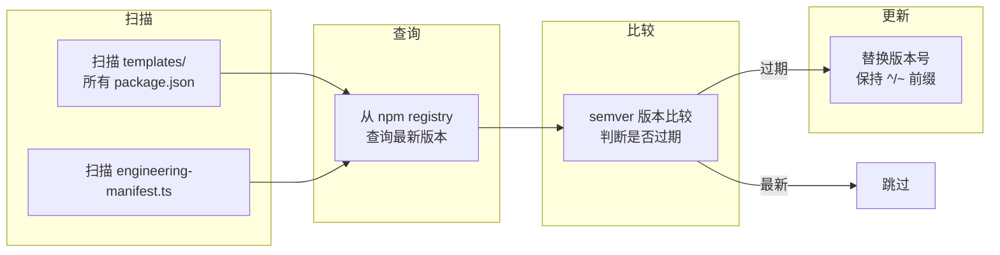
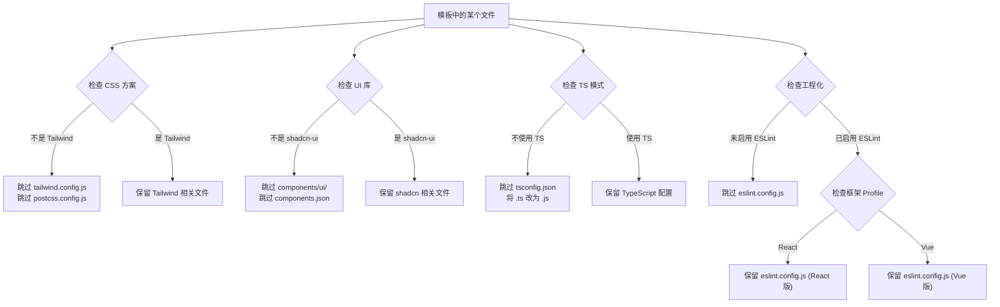
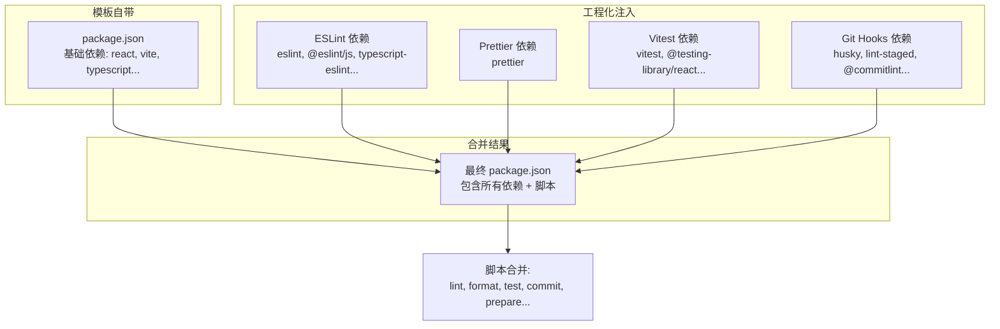
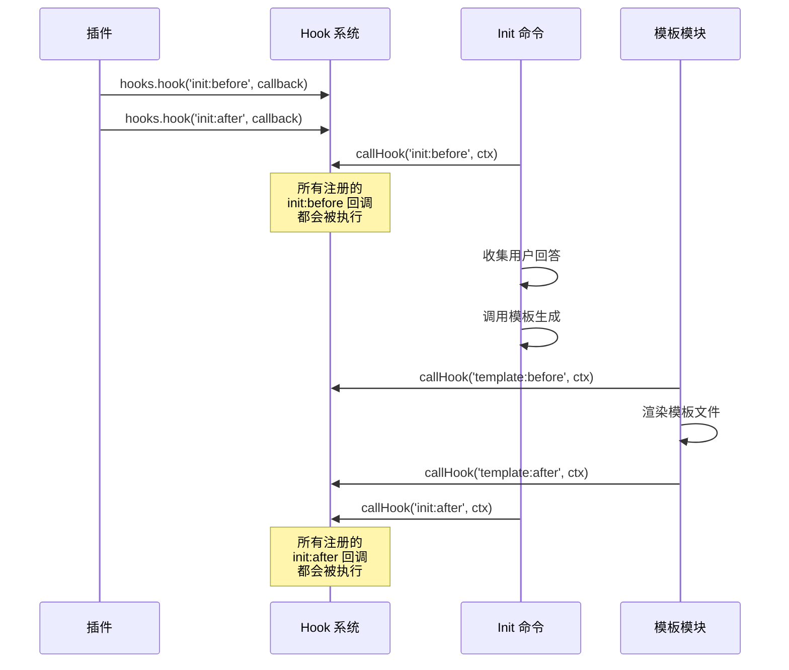

# mirajay-cli 小白入门指南

> **零基础也能看懂的前端脚手架教程**
>
> 不管你是刚入行的前端新手，还是想深入了解脚手架原理的开发者，这篇文档都会手把手带你走进 mirajay-cli 的世界。
>
> 更短的分册路径见 [文档中心 README](./README.md)；本文适合「一口气读完」。

---

## 目录导航

| 章节 | 你将学会 |
|------|---------|
| [第一章 认识 mirajay-cli](#第一章-认识-mirajay-cli) | 什么是脚手架？它能做什么？ |
| [第二章 环境准备与安装](#第二章-环境准备与安装) | 从零配置开发环境 |
| [第三章 5 分钟快速上手](#第三章-5-分钟快速上手) | 跑通第一个命令 |
| [第四章 项目结构详解](#第四章-项目结构详解) | 看懂每个文件夹的作用 |
| [第五章 核心流程走一遍](#第五章-核心流程走一遍) | 从命令到生成项目的完整链路 |
| [第六章 命令系统详解](#第六章-命令系统详解) | 每个命令背后的原理 |
| [第七章 模板引擎揭秘](#第七章-模板引擎揭秘) | EJS 模板是怎么工作的 |
| [第八章 工程化体系](#第八章-工程化体系) | ESLint、Prettier、Git Hooks |
| [第九章 Hook 插件系统](#第九章-hook-插件系统) | 如何让脚手架可扩展 |
| [第十章 实战：创建桌面 Web 项目](#第十章实战创建桌面-web-项目) | React + Vue 项目完整教程 |
| [第十一章 实战：创建移动端项目](#第十一章实战创建移动端项目) | H5 / Taro / uni-app / RN / Flutter |
| [第十二章 实战：创建微前端项目](#第十二章实战创建微前端项目) | Module Federation / wujie 等 |
| [第十三章 自定义与扩展](#第十三章自定义与扩展) | 自定义配置、模板、插件 |
| [第十四章 常见问题解答](#第十四章常见问题解答) | FAQ 与排错指南 |

---

## 第一章 认识 mirajay-cli

### 1.1 什么是"脚手架"？

**用一个比喻来说：**

想象你要盖房子：

- **没有脚手架** = 从一块空地开始，自己打地基、砌墙、接水电……一切从零开始
- **有了脚手架** = 直接拿到一个精装修的样板间，改改就能住

**在前端开发里，"脚手架"就是一个帮你快速创建项目的工具。**

它会帮你：
- ✅ 生成项目目录结构
- ✅ 配置好构建工具（Vite、Webpack）
- ✅ 集成代码检查（ESLint、Prettier）
- ✅ 设置 Git 规范（commitlint、husky）
- ✅ 安装所有需要的依赖

这样你就可以直接开始写业务代码了！

### 1.2 mirajay-cli 是什么？

mirajay-cli 是一个**企业级前端脚手架**，它的目标是：

> **用一个命令，创建任何类型的前端项目。**

```
┌─────────────────────────────────────────────────────────────────┐
│                                                                 │
│   Desktop Web    Mobile App    Micro-Frontend                   │
│   ┌─────────┐    ┌─────────┐    ┌─────────────┐                 │
│   │ React   │    │ H5      │    │ Module Fed  │                 │
│   │ Vue     │    │ Taro    │    │ wujie       │                 │
│   │ SPA     │    │ uni-app │    │ micro-app   │                 │
│   │ SSR     │    │ RN      │    │ qiankun     │                 │
│   └─────────┘    │ Flutter │    └─────────────┘                 │
│                  └─────────┘                                    │
│                                                                 │
│           ↑ 一个命令搞定 ↑                                        │
│                                                                 │
│   mirajay-cli create my-project                                 │
│                                                                 │
└─────────────────────────────────────────────────────────────────┘
```

### 1.3 它能帮你做什么？

| 能力 | 说明 | 举例 |
|------|------|------|
| 🎨 快速创建项目 | 一个命令生成完整项目 | `mirajay-cli create my-app` |
| 🖥️ 桌面 Web 开发 | React / Vue + 多种 UI 库 | Element Plus、Ant Design、shadcn/ui |
| 📱 移动端开发 | H5 / Taro / uni-app / RN / Flutter | 跨端框架 + 原生框架 |
| 🔗 微前端架构 | Module Federation / wujie 等 | 同栈 / 混合栈子应用 |
| 🔧 工程化配置 | ESLint / Prettier / Stylelint / Vitest | 三级预设一键启用 |
| 📦 Monorepo | Turborepo + pnpm workspace | 多包管理 |
| 🎯 shadcn/ui | 自动安装和配置 | input / label / separator |
| 🔌 插件扩展 | Hook 生命周期钩子 | 自定义行为和远程模板 |
| 🚀 一键更新 | 模板依赖版本自动同步 | `mirajay-cli update-deps` |

### 1.4 技术栈一览

mirajay-cli 基于 **unjs 生态** 构建，这是一套现代化的 Node.js 工具链：

```
mirajay-cli
├── citty             → 命令行框架（定义和解析命令）
├── consola           → 日志输出（漂亮的控制台信息）
├── picocolors        → 颜色处理（给文字上色）
├── @inquirer/prompts → 交互式问答（引导用户选择）
├── EJS               → 模板引擎（动态生成文件）
├── hookable          → 钩子系统（插件扩展）
├── giget             → 远程模板（从 Git 下载模板）
├── c12               → 配置加载（读取 .clirc.ts）
├── semver            → 版本比较（依赖更新）
├── execa             → 进程执行（调用其他命令）
└── tsup              → 打包工具（构建 CLI 本身）
```

---

## 第二章 环境准备与安装

### 2.1 你需要安装的东西

在开始之前，请确保你的电脑上安装了以下软件：

#### ✅ Node.js（必须）

mirajay-cli 需要 **Node.js 20.0.0 或更高版本**。

**检查是否已安装：**
```bash
node --version
# 输出: v24.18.0 或更高
```

**如果没有安装，推荐使用 nvm：**
```bash
# 安装 nvm（Node 版本管理器）
curl -o- https://raw.githubusercontent.com/nvm-sh/nvm/v0.39.7/install.sh | bash

# 安装 Node.js 24
nvm install 24

# 切换到 Node 24
nvm use 24
```

#### ✅ 包管理器（推荐 pnpm）

```bash
# 安装 pnpm
npm install -g pnpm

# 检查版本
pnpm --version
# 输出: 9.x 或更高
```

> 💡 mirajay-cli 支持 pnpm、yarn、bun、npm 四种包管理器，推荐使用 pnpm。

#### ✅ Git（必须）

```bash
# 检查是否已安装
git --version
# 输出: git version 2.x 或更高

# macOS 如果没有，使用 brew 安装
brew install git
```

### 2.2 安装 mirajay-cli

#### 方式一：从源码安装（推荐开发者）

```bash
# 克隆项目
cd /你的工作目录

# 安装依赖
pnpm install

# 构建 CLI
pnpm build

# 链接到全局（让 mirajay-cli 命令在任何地方都能用）
pnpm link --global
```

#### 方式二：直接使用已发布的包

```bash
# 如果 mirajay-cli 已经发布到 npm
npm install -g mirajay-cli

# 或者用 pnpm
pnpm add -g mirajay-cli
```

### 2.3 验证安装成功

```bash
# 查看版本
mirajay-cli --version

# 查看帮助
mirajay-cli --help

# 应该看到所有可用命令:
# init, lint, build, doctor, test, commit, deploy, upgrade, update-deps
```

### 2.4 开发模式安装

如果你想修改 mirajay-cli 的源码并实时测试：

```bash
# 进入项目目录
cd frontend-cli

# 安装依赖
pnpm install

# 启动监听模式（修改代码后自动重新构建）
pnpm dev

# 在另一个终端测试
mirajay-cli create test-project
```

---

## 第三章 5 分钟快速上手

### 3.1 创建第一个项目

让我们用 5 分钟创建一个 React + TypeScript + Tailwind CSS 的桌面 Web 项目：

```bash
# 交互式创建
mirajay-cli create my-first-app
```

然后你会看到一连串的提问，按照下面的答案选择：

```
? 项目名称 my-first-app                     ← 直接回车，用默认值
? 选择项目类型 桌面 Web 应用                  ← 选择第一个
? 选择前端框架 React                         ← 选择 React
? 是否使用 TypeScript? Yes                  ← 回车选 Yes
? 选择 UI 组件库 Ant Design                 ← 选择 Ant Design
? 选择 CSS 方案 Tailwind CSS                ← 选择 Tailwind
? 是否使用 Monorepo? No                     ← 新手先选 No
? 选择工程化预设 Standard                    ← 选推荐的 Standard
? 选择包管理器 pnpm                          ← 选 pnpm
? 是否初始化 Git 仓库? Yes                   ← 回车选 Yes
```

等待几秒，项目就创建好了！

### 3.2 启动项目

```bash
# 进入项目目录
cd my-first-app

# 启动开发服务器
pnpm dev
```

浏览器打开 `http://localhost:5173`，你应该能看到项目已经运行起来了！

### 3.3 项目常用命令

```bash
# 启动开发服务器
pnpm dev

# 构建生产版本
pnpm build

# 预览生产版本
pnpm preview

# 代码检查（ESLint）
pnpm lint

# 格式化代码（Prettier）
pnpm format

# 运行测试
pnpm test

# 提交代码（规范化提交信息）
pnpm commit
```

### 3.4 非交互模式（一键创建）

如果你已经知道想要什么，可以跳过所有提问：

```bash
# 使用默认配置快速创建
mirajay-cli create my-app -y
```

这会创建一个 Vue + Element Plus + Tailwind + Standard 工程化的项目。

### 3.5 使用远程模板

如果你有自己的模板仓库，可以直接使用：

```bash
# 从 GitHub 仓库获取模板
mirajay-cli init my-app --from gh:your-org/templates/desktop-react

# 从 GitLab 获取
mirajay-cli init my-app --from gitlab:your-org/templates/custom

# 从本地路径获取
mirajay-cli init my-app --from /path/to/your/template
```

---

## 第四章 项目结构详解

### 4.1 mirajay-cli 自身的结构

了解脚手架本身的代码结构，是二次开发的基础：

```
mirajay-cli/
│
├── bin/
│   └── cli.mjs              ← CLI 入口文件（Node.js 启动点）
│
├── src/                     ← 源代码目录
│   ├── index.ts             ← 主入口（注册所有命令）
│   ├── types.ts             ← 类型定义（共享的接口和类型）
│   ├── commands/            ← 命令实现目录
│   │   ├── init.ts          ← 创建项目（最核心的命令）
│   │   ├── lint.ts          ← 代码检查
│   │   ├── build.ts         ← 构建项目
│   │   ├── test.ts          ← 运行测试
│   │   ├── commit.ts        ← 规范化 Git 提交
│   │   ├── deploy.ts        ← CI/CD 部署
│   │   ├── doctor.ts        ← 环境诊断
│   │   ├── upgrade.ts       ← 升级 CLI 本身
│   │   └── update-deps.ts   ← 更新模板依赖版本
│   │
│   └── core/                ← 核心模块目录
│       ├── logger.ts        ← 日志输出（彩色、分级）
│       ├── prompts.ts       ← 交互式问答逻辑
│       ├── template.ts      ← 模板引擎（最核心！）
│       ├── hooks.ts         ← Hook 插件系统
│       ├── config.ts        ← CLI 配置加载
│       ├── engineering.ts  ← 工程化预设
│       ├── engineering-manifest.ts  ← 工程化依赖清单
│       ├── engineering-profile.ts  ← 平台 profile 选择
│       ├── monorepo-layout.ts      ← Monorepo 布局
│       ├── monorepo-render.ts      ← Monorepo 渲染
│       ├── monorepo-engineering.ts ← Monorepo 工程化合并
│       ├── merge-package.ts ← package.json 合并
│       ├── git-hooks.ts     ← Git Hooks 文件生成
│       ├── git-config.ts    ← Git 基础配置
│       ├── shadcn.ts        ← shadcn/ui 集成
│       ├── shadcn-tsconfig.ts       ← shadcn tsconfig 处理
│       ├── shadcn.constants.ts      ← shadcn 默认组件
│       ├── flutter-sdk.ts   ← Flutter SDK 检测
│       ├── typescript-mode.ts      ← TS/JS 模式切换
│       ├── remote-templates.ts     ← 远程模板下载
│       ├── templates-dir.ts ← 模板目录定位
│       ├── deps-registry.ts ← 依赖版本管理
│       ├── workspace.ts     ← Workspace 工具函数
│       ├── dev-hints.ts     ← 开发提示
│       ├── next-steps.ts    ← 下一步建议
│       ├── readme-context.ts ← README 生成上下文
│       └── utils.ts         ← 通用工具函数
│
├── templates/                ← 项目模板目录
│   ├── desktop-react/       ← React 桌面 Web 模板
│   ├── desktop-vue/         ← Vue 桌面 Web 模板
│   ├── mobile-h5-react/     ← H5 React 模板
│   ├── mobile-h5-vue/       ← H5 Vue 模板
│   ├── mobile-taro/         ← Taro 跨端模板
│   ├── mobile-uni-app/      ← uni-app 模板
│   ├── mobile-rn/           ← React Native 模板
│   ├── mobile-flutter/      ← Flutter 模板
│   ├── micro-module-federation-react/
│   ├── micro-module-federation-vue/
│   ├── micro-module-federation-mixed-react-vue/
│   ├── micro-module-federation-mixed-vue-react/
│   ├── micro-wujie-react/
│   ├── micro-wujie-vue/
│   ├── micro-micro-app-react/
│   ├── micro-micro-app-vue/
│   ├── micro-qiankun-react/
│   ├── micro-qiankun-vue/
│   ├── monorepo-base/       ← Monorepo 基础配置
│   ├── engineering-base/    ← 工程化基础配置
│   └── git-base/            ← Git 基础配置
│
├── tests/                    ← 测试文件
├── dist/                     ← 构建产物（编译后的 JS）
├── scripts/                  ← 辅助脚本
├── doc/                      ← 文档目录
├── package.json              ← 项目配置
├── tsup.config.ts            ← 打包配置
├── vitest.config.ts          ← 测试配置
└── README.md                 ← 项目说明
```

### 4.2 各层职责说明

用一个**餐厅的比喻**来理解分层架构：

```
┌──────────────────────────────────────────────────────────────────┐
│                                                                  │
│  🧑‍💻 入口层 (bin/cli.mjs)                                          │
│  顾客进门，触发整个服务流程                                          │
│                                                                  │
│  ┌──────────────────────────────────────────────────────────┐    │
│  │  🍽️ 命令层 (src/commands/)                                │    │
│  │  服务员接收顾客的具体请求（点菜）                             │    │
│  │  ├── init.ts      → 厨师长：负责整个做菜流程                 │    │
│  │  ├── lint.ts      → 质检员：检查菜品质量                    │    │
│  │  ├── build.ts     → 打包员：包装外带                       │    │
│  │  ├── test.ts      → 试菜员：品尝新菜品                      │    │
│  │  └── ...          → 其他职能角色                           │    │
│  └──────────────────────────────────────────────────────────┘    │
│                                                                  │
│  ┌──────────────────────────────────────────────────────────┐    │
│  │  👨‍🍳 核心层 (src/core/)                                   │    │
│  │  后厨的各个工作岗位                                        │    │
│  │  ├── prompts.ts    → 点菜员：询问顾客需求                  │    │
│  │  ├── template.ts   → 主厨：核心烹饪流程                   │    │
│  │  ├── engineering.ts → 调料师：准备调味料                  │    │
│  │  ├── hooks.ts      → 传菜员：传递信号                      │    │
│  │  └── ...          → 其他后厨岗位                           │    │
│  └──────────────────────────────────────────────────────────┘    │
│                                                                  │
│  ┌──────────────────────────────────────────────────────────┐    │
│  │  🥘 模板层 (templates/)                                   │    │
│  │  菜谱和食材库                                              │    │
│  │  ├── desktop-react/ → 菜谱：React 版桌面应用                │    │
│  │  ├── mobile-taro/   → 菜谱：Taro 跨端应用                  │    │
│  │  └── engineering-base/ → 调味料：工程化配置                 │    │
│  └──────────────────────────────────────────────────────────┘    │
│                                                                  │
└──────────────────────────────────────────────────────────────────┘
```

### 4.3 数据流向

从用户输入到项目生成，数据经过以下流程：

```
用户输入命令              命令解析              交互式问答
┌──────────────┐     ┌──────────────┐     ┌──────────────┐
│ mirajay-cli  │────▶│  citty 框架  │────▶│  @inquirer    │
│ create my-app│     │  解析参数     │     │  /prompts     │
└──────────────┘     └──────────────┘     └───────┬───────┘
                                                  │
                                                  ▼
┌──────────────┐     ┌──────────────┐     ┌──────────────┐
│  安装依赖     │◀────│  模板渲染     │◀────│  模板选择      │
│  pnpm install│     │  EJS 渲染    │     │  resolveTpl   │
└──────────────┘     └──────────────┘     └──────────────┘
                                                  │
                                                  ▼
┌──────────────┐     ┌──────────────┐     ┌──────────────┐
│  完成！       │◀────│  初始化 Git   │◀────│  合并工程化   │
│  项目就绪     │     │  git init    │     │  package.json│
└──────────────┘     └──────────────┘     └──────────────┘
```

---

## 第五章 核心流程走一遍

### 5.1 完整流程图

当你运行 `mirajay-cli create my-app` 时，背后发生了这些事情：

```mermaid
flowchart TD
    Start(["用户输入<br/>mirajay-cli create my-app"]) --> Banner["显示 Banner<br/>mirajay-cli 标志"]
    Banner --> LoadConfig["加载 CLI 配置<br/>loadCliConfig()"]
    LoadConfig --> CheckYes{"使用<br/>-y 参数?"}
    
    CheckYes -->|是| Default["使用默认配置<br/>跳过问答"]
    CheckYes -->|否| Prompts["运行交互式问答<br/>runInitPrompts()"]
    
    Prompts --> P1["① 输入项目名称"]
    P1 --> P2["② 选择项目类型<br/>桌面/移动/微前端"]
    P2 --> P3["③ 选择技术栈<br/>React/Vue/平台"]
    P3 --> P4["④ 选择 UI 库"]
    P4 --> P5["⑤ 选择 CSS 方案"]
    P5 --> P6["⑥ 选择工程化预设"]
    P6 --> P7["⑦ 选择包管理器"]
    P7 --> P8["⑧ 是否初始化 Git"]
    
    Default --> Validate
    P8 --> Validate["验证答案<br/>validateAnswers()"]
    
    Validate --> CheckDir{"目录是否<br/>已存在?"}
    CheckDir -->|是| ErrorDir["❌ 报错退出"]
    CheckDir -->|否| ResolveTpl["解析模板名称<br/>resolveTemplateName()"]
    
    ResolveTpl --> HookBefore["触发 init:before 钩子"]
    HookBefore --> HookPrompts["触发 init:prompts 钩子"]
    HookPrompts --> Generate["生成项目<br/>generateProject()"]
    
    subgraph 模板生成流程
        Generate --> Collect["收集模板文件<br/>collectFiles()"]
        Collect --> Filter["过滤文件<br/>shouldSkipFile()"]
        Filter --> Render["EJS 渲染<br/>ejs.render()"]
        Render --> Merge["合并工程化配置<br/>mergePackageManifest()"]
        Merge --> Monorepo{"使用<br/>Monorepo?"}
        Monorepo -->|是| SetupMono["配置 Monorepo 布局"]
        Monorepo -->|否| SkipMono[/"跳过"/]
        SetupMono --> SkipMono
    end
    
    SkipMono --> GitInit{"初始化 Git?"}
    GitInit -->|是| DoGit["git init + 首次提交"]
    GitInit -->|否| Install
    DoGit --> Install
    
    Install["安装依赖<br/>pnpm install"] --> Shadcn{"使用<br/>shadcn/ui?"}
    Shadcn -->|是| InstallShadcn["安装 shadcn 组件"]
    Shadcn -->|否| HookAfter
    InstallShadcn --> HookAfter
    
    HookAfter["触发 init:after 钩子"] --> Done(["✅ 项目创建成功!"])
    
    style Start fill:#4a90d9,color:#fff
    style Done fill:#50c878,color:#fff
    style ErrorDir fill:#e74c3c,color:#fff
```



### 5.2 关键步骤说明

#### 步骤 1：加载配置

```typescript
// src/core/config.ts
export async function loadCliConfig(cwd) {
  // 从 .clirc.ts 文件加载用户自定义配置
  // 如果没有配置文件，使用默认值
  const { config } = await loadConfig({
    name: 'cli',
    rcFile: '.clirc',
    defaults: {
      defaultPackageManager: 'pnpm',
      defaultEngineeringPreset: 'standard',
    },
  })
  return { ...DEFAULT_CONFIG, ...config }
}
```

#### 步骤 2：交互式问答

```typescript
// src/core/prompts.ts - 简化版
export async function runInitPrompts(projectName?) {
  // 如果没有传项目名，询问用户
  const name = projectName || await input({ message: '项目名称' })
  
  // 选择项目类型
  const projectType = await select({
    message: '选择项目类型',
    choices: [
      { name: '桌面 Web 应用', value: 'desktop' },
      { name: '移动端应用', value: 'mobile' },
      { name: '微前端架构', value: 'micro-frontend' },
    ],
  })
  
  // 根据项目类型，继续提问...
  // （问答是动态的，根据之前的答案调整）
}
```

#### 步骤 3：选择模板

```typescript
// src/core/template.ts - 简化版
export function resolveTemplateName(answers) {
  // 根据用户答案，计算出应该使用哪个模板
  if (answers.projectType === 'desktop') {
    return answers.framework === 'vue' ? 'desktop-vue' : 'desktop-react'
  }
  if (answers.projectType === 'mobile') {
    switch (answers.mobilePlatform) {
      case 'h5': return answers.framework === 'vue' ? 'mobile-h5-vue' : 'mobile-h5-react'
      case 'taro': return 'mobile-taro'
      case 'flutter': return 'mobile-flutter'
      // ...
    }
  }
}
```

#### 步骤 4：模板渲染

```typescript
// src/core/template.ts - 简化版
async function renderFile(sourcePath, targetPath, context) {
  const content = await readFile(sourcePath, 'utf-8')
  
  // 使用 EJS 渲染模板
  const rendered = ejs.render(content, context, {
    escape: (value) => String(value),
  })
  
  await writeFile(targetPath, rendered, 'utf-8')
}
```

#### 步骤 5：合并工程化配置

```typescript
// src/core/merge-package.ts
export async function mergePackageManifest(targetDir, patch) {
  // 读取现有的 package.json
  const pkg = JSON.parse(await readFile(pkgPath, 'utf-8'))
  
  // 合并依赖
  pkg.devDependencies = {
    ...pkg.devDependencies,
    ...patch.devDependencies,
  }
  
  // 合并脚本
  pkg.scripts = {
    ...pkg.scripts,
    ...patch.scripts,
  }
  
  // 写回 package.json
  await writeFile(pkgPath, JSON.stringify(pkg, null, 2))
}
```

---

## 第六章 命令系统详解

### 6.1 命令列表

mirajay-cli 提供了以下命令：

| 命令 | 作用 | 源码位置 |
|------|------|---------|
| `init` / `create` | 创建新项目 | `src/commands/init.ts` |
| `lint` | 运行代码检查 | `src/commands/lint.ts` |
| `build` | 构建项目 | `src/commands/build.ts` |
| `test` | 运行测试 | `src/commands/test.ts` |
| `commit` | 规范化 Git 提交 | `src/commands/commit.ts` |
| `doctor` | 环境诊断 | `src/commands/doctor.ts` |
| `deploy` | CI/CD 部署 | `src/commands/deploy.ts` |
| `upgrade` | 升级 CLI | `src/commands/upgrade.ts` |
| `update-deps` | 更新模板依赖 | `src/commands/update-deps.ts` |

### 6.2 命令是怎么注册的？

mirajay-cli 使用 **citty** 框架来管理命令，注册方式非常简单：

```typescript
// src/index.ts
import { defineCommand, runMain } from 'citty'
import init from './commands/init.js'
import lint from './commands/lint.js'
import build from './commands/build.js'

const main = defineCommand({
  meta: {
    name: 'mirajay-cli',
    version: '1.0.0',
    description: '企业级前端脚手架',
  },
  subCommands: {
    init,
    create: init,
    lint,
    build,
    test,
    commit,
    doctor,
    deploy,
    upgrade,
    'update-deps': updateDeps,
  },
  run() {
    banner()
    console.log('使用 mirajay-cli --help 查看可用命令')
  },
})

runMain(main)
```

### 6.3 命令的结构

每个命令都遵循相同的结构模式：

```typescript
// src/commands/init.ts
export default defineCommand({
  meta: {
    name: 'init',
    description: '初始化新项目',
  },
  args: {
    name: {
      type: 'positional',
      description: '项目名称',
      required: false,
    },
    dir: {
      type: 'string',
      description: '目标目录',
      alias: 'd',
    },
    yes: {
      type: 'boolean',
      description: '跳过交互式问答',
      alias: 'y',
      default: false,
    },
  },
  async run({ args }) {
    // 命令的实际逻辑
  },
})
```

### 6.4 init 命令的参数

```bash
mirajay-cli create [name] [options]

# 位置参数
# name            项目名称

# 选项
# -d, --dir       指定目标目录
# -y, --yes       跳过交互式问答（使用默认配置）
# -f, --from      指定远程模板来源
```

**使用示例：**

```bash
# 1. 基础用法
mirajay-cli create my-app

# 2. 指定目录
mirajay-cli create my-app -d /path/to/dir

# 3. 跳过问答
mirajay-cli create my-app -y

# 4. 使用远程模板
mirajay-cli init my-app -f gh:org/repo/templates/custom
```

### 6.5 update-deps 命令

这是一个**维护者专用**的命令，用于更新模板中的依赖版本：

```bash
# 预览可更新的依赖（不修改文件）
mirajay-cli update-deps --dry-run

# 一键更新所有模板的依赖
mirajay-cli update-deps

# 只更新特定包
mirajay-cli update-deps -p react -p vite

# 同时更新 CLI 自身的依赖
mirajay-cli update-deps --include-cli

# CI 模式：检查是否有可更新依赖
mirajay-cli update-deps --check
```

**它的工作原理：**



---

## 第七章 模板引擎揭秘

### 7.1 什么是 EJS？

EJS（Embedded JavaScript）是一个简单的模板引擎，它允许你在 HTML/文本文件中嵌入 JavaScript 代码。

**EJS 基础语法：**

```ejs
<%= variable %>    ← 输出变量值（转义）
<%- variable %>    ← 输出变量值（不转义）
<% if (condition) { %>    ← JavaScript 代码
<% } %>
<% for (item of list) { %>
  <div><%= item.name %></div>
<% } %>
```

### 7.2 mirajay-cli 中的 EJS 使用

在 mirajay-cli 中，模板文件以 `.ejs` 结尾，渲染后去掉 `.ejs` 后缀。

**示例：`package.json.ejs`**

```json
{
  "name": "<%= projectName %>",
  "version": "1.0.0",
  "type": "module",
  "scripts": {
    "dev": "vite",
    "build": "vite build",
    "lint": "eslint .",
    "format": "prettier --write ."
  },
  "dependencies": {
    "react": "^19.0.0",
    "react-dom": "^19.0.0"
  },
  "devDependencies": {
    "typescript": "^5.7.3",
    "vite": "^7.0.0"
  }
}
```

渲染后：

```json
{
  "name": "my-project",
  "version": "1.0.0",
  "type": "module",
  "scripts": {
    "dev": "vite",
    "build": "vite build",
    "lint": "eslint .",
    "format": "prettier --write ."
  },
  "dependencies": {
    "react": "^19.0.0",
    "react-dom": "^19.0.0"
  },
  "devDependencies": {
    "typescript": "^5.7.3",
    "vite": "^7.0.0"
  }
}
```

### 7.3 可用的模板变量

在 EJS 模板中，你可以使用以下变量（统称为 `RenderContext`）：

| 变量 | 类型 | 说明 |
|------|------|------|
| `projectName` | string | 项目名称 |
| `year` | number | 当前年份 |
| `framework` | 'react' / 'vue' | 前端框架 |
| `uiLibrary` | string | UI 库名称 |
| `cssFramework` | string | CSS 方案 |
| `useTypeScript` | boolean | 是否使用 TypeScript |
| `engineering` | EngineeringOptions | 工程化配置对象 |
| `packageManager` | string | 包管理器 |
| `sharedPackageName` | string | 共享包名（Monorepo） |
| `mobilePlatform` | string | 移动平台 |
| `flutterStateManagement` | string | Flutter 状态管理 |
| `flutterTargetPlatforms` | string[] | Flutter 目标平台 |
| `readmeCommandsSection` | string | README 命令部分 |
| `readmeStructureSection` | string | README 结构部分 |

### 7.4 条件渲染

mirajay-cli 支持**条件渲染**，根据用户选择跳过不需要的文件。



### 7.5 文件输出映射

某些模板文件在渲染后会被重命名，以匹配最终的框架配置：

```typescript
// src/core/template.ts
const ENGINEERING_OUTPUT_MAP = {
  'eslint.react.config.js.ejs': 'eslint.config.js',
  'eslint.vue.config.js.ejs': 'eslint.config.js',
  'stylelint.react.config.mjs.ejs': 'stylelint.config.mjs',
  'stylelint.vue.config.mjs.ejs': 'stylelint.config.mjs',
  'vitest.config.react.ts.ejs': 'vitest.config.ts',
  'vitest.config.vue.ts.ejs': 'vitest.config.ts',
  'git-hooks/commitlint.config.cjs.ejs': 'commitlint.config.cjs',
  'git-hooks/lint-staged.config.mjs.ejs': 'lint-staged.config.mjs',
  'git-hooks/husky/pre-commit.ejs': '.husky/pre-commit',
  'git-hooks/husky/commit-msg.ejs': '.husky/commit-msg',
}
```

---

## 第八章 工程化体系

### 8.1 什么是"工程化"？

**工程化**就是为了保证代码质量和团队协作而设置的一系列工具和规范。

**用一个比喻来说：**

| 工具 | 比喻 | 作用 |
|------|------|------|
| ESLint | 📝 语法老师 | 检查代码风格和错误 |
| Prettier | ✂️ 格式整理师 | 自动格式化代码 |
| Stylelint | 🎨 样式检查员 | 检查 CSS 规范 |
| markdownlint | 📄 文档检查器 | 检查 Markdown 格式 |
| cspell | 📖 拼写检查器 | 检查代码中的拼写错误 |
| Vitest | 🧪 测试框架 | 运行单元测试 |
| commitlint | ✍️ 提交规范 | 规范 Git 提交信息格式 |
| husky | 🐕 Git 钩子 | 在 Git 操作时自动执行脚本 |
| lint-staged | 🎯 暂存检查 | 只检查被修改的文件 |

### 8.2 三级预设

mirajay-cli 提供了三种预设方案：

```
┌──────────────────────────────────────────────────────────────────────────┐
│                                                                          │
│   工具          Minimal    Standard    Strict    说明                   │
│   ─────────    ────────    ────────    ────────    ──────────────       │
│   ESLint        ✓          ✓          ✓          代码检查               │
│   Prettier      ✓          ✓          ✓          代码格式化             │
│   Stylelint     ✗          ✓          ✓          样式检查               │
│   markdownlint  ✗          ✓          ✓          文档检查               │
│   cspell        ✗          ✗          ✓          拼写检查               │
│   Vitest        ✗          ✓          ✓          单元测试               │
│   commitlint    ✗          ✓          ✓          提交规范               │
│   husky         ✗          ✓          ✓          Git 钩子               │
│   lint-staged   ✗          ✓          ✓          暂存检查               │
│                                                                          │
│   推荐场景:                                                              │
│   Minimal   → 个人项目 / 快速原型                                        │
│   Standard  → 团队协作 / 企业项目 ← 推荐                                 │
│   Strict    → 严格规范 / 开源项目                                        │
│                                                                          │
└──────────────────────────────────────────────────────────────────────────┘
```

### 8.3 预设的代码实现

```typescript
// src/core/engineering-manifest.ts
export const PRESET_DEFINITIONS = {
  minimal: {
    eslint: true,
    prettier: true,
    stylelint: false,
    markdownlint: false,
    spellcheck: false,
    vitest: false,
    commitlint: false,
    husky: false,
    lintStaged: false,
  },
  standard: {
    eslint: true,
    prettier: true,
    stylelint: true,
    markdownlint: true,
    spellcheck: false,
    vitest: true,
    commitlint: true,
    husky: true,
    lintStaged: true,
  },
  strict: {
    eslint: true,
    prettier: true,
    stylelint: true,
    markdownlint: true,
    spellcheck: true,
    vitest: true,
    commitlint: true,
    husky: true,
    lintStaged: true,
  },
}
```

### 8.4 多平台 ESLint 配置

不同的平台/框架需要不同的 ESLint 配置：

```
┌─────────────────────────────────────────────────────────────────┐
│                                                                 │
│  平台 Profile              ESLint 配置文件                       │
│  ──────────────────        ──────────────────────                │
│  React                     eslint.react.config.js               │
│  Vue                       eslint.vue.config.js                │
│  Taro (React)              eslint.taro.react.config.js          │
│  Taro (Vue)                eslint.taro.vue.config.js           │
│  uni-app                   eslint.uni-app.config.js             │
│  React Native              eslint.react-native.config.js       │
│                                                                 │
│  mirajay-cli 会根据你的选择                                    │
│  自动使用正确的 ESLint 配置文件                                  │
│                                                                 │
└─────────────────────────────────────────────────────────────────┘
```

### 8.5 package.json 合并

工程化配置的核心是将依赖和脚本合并到 `package.json` 中：



### 8.6 生成的 package.json 示例

```json
{
  "name": "my-project",
  "scripts": {
    "dev": "vite",
    "build": "vite build",
    "lint": "prettier --write . && eslint . && stylelint ... && markdownlint ...",
    "lint:eslint": "eslint .",
    "lint:style": "stylelint \"**/*.{css,scss}\"",
    "lint:md": "markdownlint \"**/*.md\"",
    "format": "prettier --write .",
    "format:check": "prettier --check .",
    "test": "vitest run",
    "test:watch": "vitest",
    "commit": "cz",
    "prepare": "husky"
  },
  "devDependencies": {
    "prettier": "^3.5.2",
    "eslint": "^9.21.0",
    "@eslint/js": "^9.21.0",
    "typescript-eslint": "^8.25.0",
    "eslint-plugin-react-hooks": "^5.2.0",
    "vitest": "^3.0.8",
    "@testing-library/react": "^16.2.0",
    "husky": "^9.1.7",
    "lint-staged": "^15.4.3",
    "@commitlint/cli": "^19.8.0",
    "@commitlint/config-conventional": "^19.8.0",
    "cz-git": "^1.11.1"
  },
  "config": {
    "commitizen": {
      "path": "node_modules/cz-git"
    }
  }
}
```

---

## 第九章 Hook 插件系统

### 9.1 什么是 Hook？

Hook（钩子）是一种**在特定时刻执行自定义代码**的机制。

**生活中的类比：**

想象你去餐厅吃饭：
- 你点餐（触发事件）
- 服务员记下你的订单（Hook 触发前）
- 厨师做菜（主要逻辑）
- 服务员上菜（Hook 触发后）

在 mirajay-cli 中，Hook 让你可以在命令执行的关键节点插入自定义逻辑。

### 9.2 Hook 列表

| Hook | 触发时机 | 参数 |
|------|---------|------|
| `init:before` | 项目初始化开始前 | `{ projectName, targetDir, answers }` |
| `init:prompts` | 用户回答收集后 | `answers` |
| `init:after` | 项目初始化完成后 | `{ projectName, targetDir, answers }` |
| `template:before` | 模板渲染前 | `{ templateName, targetDir, answers }` |
| `template:after` | 模板渲染后 | `{ templateName, targetDir, answers }` |
| `lint:before` | Lint 执行前 | 无 |
| `lint:after` | Lint 执行后 | 无 |
| `build:before` | 构建执行前 | 无 |
| `build:after` | 构建执行后 | 无 |

### 9.3 Hook 的工作流程



### 9.4 Hook 的源码实现

```typescript
// src/core/hooks.ts
import { createHooks } from 'hookable

// 定义 Hook 接口（类型安全）
export interface CliHooks {
  'init:before': (ctx: InitContext) => void | Promise<void>
  'init:after': (ctx: InitContext) => void | Promise<void>
  'init:prompts': (answers: Partial<ProjectAnswers>) => void | Promise<void>
  'template:before': (ctx: TemplateContext) => void | Promise<void>
  'template:after': (ctx: TemplateContext) => void | Promise<void>
  'lint:before': () => void | Promise<void>
  'lint:after': () => void | Promise<void>
  'build:before': () => void | Promise<void>
  'build:after': () => void | Promise<void>
}

// 创建 Hook 实例
export const hooks = createHooks<CliHooks>()
```

### 9.5 使用 Hook 编写插件

#### 方式一：直接使用 hooks 对象

```typescript
// my-plugin.ts - 自定义插件示例
import { hooks } from 'mirajay-cli/core/hooks'

// 在项目初始化前，打印信息
hooks.hook('init:before', ({ projectName }) => {
  console.log(`🚀 正在创建项目: ${projectName}`)
})

// 在模板生成后，执行自定义逻辑
hooks.hook('template:after', async ({ targetDir }) => {
  // 例如：添加自定义的配置文件
  await generateCustomConfig(targetDir)
})

// 在项目完成后，打印总结
hooks.hook('init:after', ({ projectName, targetDir }) => {
  console.log(`✅ 项目创建完成: ${projectName}`)
  console.log(`📂 位置: ${targetDir}`)
})
```

#### 方式二：使用 registerPlugin 注册

这是更规范的插件注册方式，适合打包成 npm 包的场景：

```typescript
// my-plugin.ts
import { registerPlugin, hooks } from 'mirajay-cli/core/hooks'

// 定义插件对象
const myPlugin = registerPlugin({
  name: 'my-custom-plugin',  // 插件名称
  setup() {
    // setup 函数在插件加载时执行
    hooks.hook('init:before', ({ projectName }) => {
      console.log(`🚀 [${myPlugin.name}] 创建项目: ${projectName}`)
    })
    
    hooks.hook('template:after', async ({ targetDir }) => {
      console.log(`✨ [${myPlugin.name}] 模板渲染完成`)
      // 可以在这里添加自定义文件
    })
    
    hooks.hook('init:after', () => {
      console.log(`✅ [${myPlugin.name}] 项目初始化结束`)
    })
  },
})

// 导出给外部使用
export default myPlugin
```

#### 方式三：在 .clirc.ts 中自动加载插件

```typescript
// .clirc.ts
import myPlugin from './my-plugin'

export default {
  plugins: [myPlugin],
  // 其他配置...
}
```

**三种方式的对比：**

| 方式 | 适用场景 | 优点 |
|------|---------|------|
| 直接 hooks.hook | 简单脚本、临时修改 | 快速、直接 |
| registerPlugin | 可复用的插件、npm 包 | 规范、有名称 |
| .clirc.ts 配置 | 团队统一配置 | 自动加载、无需手动 import |

### 9.6 在 Init 命令中触发 Hook

```typescript
// src/commands/init.ts - 简化版
export default defineCommand({
  async run({ args }) {
    // ... 前置逻辑 ...
    
    // 触发 init:before Hook
    await hooks.callHook('init:before', { projectName, targetDir, answers })
    
    // 触发 init:prompts Hook
    await hooks.callHook('init:prompts', answers)
    
    // 生成项目
    await generateProject({ ... })
    
    // 触发 init:after Hook
    await hooks.callHook('init:after', { projectName, targetDir, answers })
    
    success('项目创建成功！')
  },
})
```

---

## 第十章 实战：创建桌面 Web 项目

### 10.1 React + Ant Design 项目

```bash
mirajay-cli create admin-dashboard
```

**问答选择：**
```
? 选择项目类型 → 桌面 Web 应用
? 选择前端框架 → React
? 是否使用 TypeScript? → Yes
? 选择 UI 组件库 → Ant Design
? 选择 CSS 方案 → Tailwind CSS
? 是否使用 Monorepo? → No
? 选择工程化预设 → Standard
? 选择包管理器 → pnpm
? 是否初始化 Git? → Yes
```

**生成的项目结构：**
```
admin-dashboard/
├── src/
│   ├── components/
│   ├── lib/
│   ├── styles/
│   ├── App.tsx
│   └── main.tsx
├── index.html
├── package.json
├── tsconfig.json
├── vite.config.ts
├── eslint.config.js
├── prettier.config.mjs
├── stylelint.config.mjs
├── vitest.config.ts
├── .husky/
├── commitlint.config.cjs
└── README.md
```

### 10.2 Vue + Element Plus 项目

```bash
mirajay-cli create vue-admin
```

**问答选择：**
```
? 选择项目类型 → 桌面 Web 应用
? 选择前端框架 → Vue
? 是否使用 TypeScript? → Yes
? 选择 UI 组件库 → Element Plus
? 选择 CSS 方案 → Tailwind CSS
? 是否使用 Monorepo? → Yes
? 选择工程化预设 → Standard
? 选择包管理器 → pnpm
? 是否初始化 Git? → Yes
```

**生成的 Monorepo 结构：**
```
vue-admin/
├── apps/
│   └── web/
│       ├── src/
│       │   ├── styles/
│       │   ├── views/
│       │   ├── App.vue
│       │   └── main.ts
│       ├── index.html
│       ├── package.json          # ESLint / Stylelint / Vitest
│       ├── eslint.config.js
│       ├── stylelint.config.mjs
│       ├── vitest.config.ts
│       └── vite.config.ts
├── packages/
│   └── shared/
│       ├── src/
│       │   └── index.ts
│       └── package.json          # 不单独注入 lint
├── turbo.json
├── pnpm-workspace.yaml
├── package.json                  # turbo + Prettier 等共享工具 + Git hooks
├── prettier.config.mjs           # 全仓共享格式化
├── .editorconfig
├── .husky/
├── commitlint.config.cjs
├── lint-staged.config.mjs
└── README.md
```

> Monorepo（含 Module Federation）统一：**根目录**放 Prettier / EditorConfig / markdownlint / cspell 与 Git hooks；**主应用**放 ESLint / Stylelint / Vitest。详见 [工程化体系](./06-工程化体系.md) 与 [changelog](./changelog.md)。

#### 根资源 & 包间引用（必读）

生成后请在**仓库根**操作：

```bash
pnpm install    # 建立 workspace 链接
pnpm format     # 用根上的 Prettier（配置在根 prettier.config.mjs）
pnpm build      # turbo 调度 apps/web 构建
```

**根目录资源怎么被用到？**

- 根装着 `prettier` / `turbo` / husky 等全仓工具；子包通过根脚本和「配置向上查找」受益，而不是 `import` 根文件。
- 例如 Prettier：从被格式化的文件目录一路往上找到根上的 `prettier.config.mjs`。

**子包怎么调用另一个包？**

`apps/web/package.json` 中已有：

```json
"@vue-admin/shared": "workspace:*"
```

（包名随项目名变化，形如 `@<projectName>/shared`。）

在 `apps/web` 源码中：

```ts
import { formatDate, capitalize } from '@vue-admin/shared'
```

pnpm 会把 `@vue-admin/shared` 软链到 `packages/shared`。安装后可检查：

```bash
ls -la apps/web/node_modules/@vue-admin/shared
# → ../../../../packages/shared
```

更完整的图示与禁忌（避免循环依赖、避免相对路径穿透）见 [05-模板系统详解](./05-模板系统详解.md#根目录资源如何被用到子包如何互相引用)。

### 10.3 shadcn/ui 项目

```bash
mirajay-cli create shadcn-app
```

**问答选择：**
```
? 选择项目类型 → 桌面 Web 应用
? 选择前端框架 → React
? 是否使用 TypeScript? → Yes
? 选择 UI 组件库 → shadcn/ui
? CSS 方案自动设为 → Tailwind CSS
```

**shadcn/ui 的特殊处理：**

选择 shadcn/ui 时，脚手架会自动：

1. ✅ 安装 `input`、`label`、`separator` 三个基础组件
2. ✅ 配置 `components.json`
3. ✅ 设置 `@/*` 路径别名
4. ✅ 创建 `lib/utils.ts` 工具文件
5. ✅ 创建 `components/ui/` 组件目录

**后续添加更多组件：**
```bash
# 添加按钮组件
pnpm ui:add button

# 添加对话框组件
pnpm ui:add dialog

# 添加表单组件
pnpm ui:add form
```

### 10.4 桌面 Web 支持的 UI 库

**React 生态：**

| UI 库 | 标识 | 特点 |
|------|------|------|
| Ant Design | `antd` | 企业级后台首选 |
| MUI | `@mui/material` | Material Design 风格 |
| NextUI | `@nextui-org/react` | 现代化 UI 框架 |
| shadcn/ui | `shadcn-ui` | 可定制、开源 |
| Mantine | `@mantine/core` | 轻量、可定制 |
| Chakra UI | `@chakra-ui/react` | 无障碍、响应式 |

**Vue 生态：**

| UI 库 | 标识 | 特点 |
|------|------|------|
| Element Plus | `element-plus` | 最流行的 Vue3 组件库 |
| Ant Design Vue | `ant-design-vue` | Ant Design 的 Vue 实现 |
| Naive UI | `naive-ui` | 类型安全、主题丰富 |
| Vuetify | `vuetify` | Material Design 风格 |
| PrimeVue | `primevue` | 丰富的 UI 套件 |

---

## 第十一章 实战：创建移动端项目

### 11.1 H5 移动端项目

**React + Ant Design Mobile：**
```bash
mirajay-cli create mobile-app
# 选择: 移动端 → H5 → React → Ant Design Mobile
```

**Vue + Vant：**
```bash
mirajay-cli create mobile-app
# 选择: 移动端 → H5 → Vue → Vant
```

**生成的 H5 项目结构：**
```
mobile-app/
├── src/
│   ├── App.tsx
│   └── main.tsx
├── index.html
├── package.json
├── tsconfig.json
└── vite.config.ts
```

### 11.2 Taro 跨端项目

Taro 可以一套代码多端运行（微信小程序、H5、App）。

```bash
mirajay-cli create taro-app
```

**问答选择：**
```
? 选择项目类型 → 移动端应用
? 选择移动端平台 → 跨端框架（Taro）
? 选择前端框架 → React（或 Vue）
? 选择工程化预设 → Standard
? 选择包管理器 → pnpm
```

**生成的 Taro 项目结构：**
```
taro-app/
├── config/
│   ├── index.ts
│   ├── dev.ts
│   └── prod.ts
├── src/
│   ├── pages/
│   │   └── index/
│   │       ├── index.config.ts
│   │       ├── index.tsx
│   │       └── index.scss
│   ├── app.config.ts
│   ├── app.tsx
│   └── app.scss
├── types/
│   └── global.d.ts
├── package.json
├── project.config.json
├── tsconfig.json
└── babel.config.cjs
```

### 11.3 uni-app 项目

uni-app 也是跨端框架，使用 Vue 语法。

```bash
mirajay-cli create uni-app
```

**问答选择：**
```
? 选择项目类型 → 移动端应用
? 选择移动端平台 → 跨端框架（uni-app）
? 框架自动设为 → Vue
? UI 库自动设为 → @dcloudio/uni-ui
```

**生成的 uni-app 项目结构：**
```
uni-app/
├── src/
│   ├── pages/
│   │   └── index/
│   │       └── index.vue
│   ├── App.vue
│   ├── main.ts
│   ├── manifest.json
│   ├── pages.json
│   └── index.html
├── package.json
├── tsconfig.json
└── vite.config.ts
```

### 11.4 React Native 项目

```bash
mirajay-cli create rn-app
```

**问答选择：**
```
? 选择项目类型 → 移动端应用
? 选择移动端平台 → React Native
? 框架自动设为 → React
? 固定使用 → TypeScript
```

**生成的 RN 项目结构（Expo Router）：**
```
rn-app/
├── app/
│   ├── _layout.tsx
│   └── index.tsx
├── app.json
├── babel.config.js
├── package.json
└── tsconfig.json
```

### 11.5 Flutter 项目

```bash
mirajay-cli create flutter-app
```

**问答选择：**
```
? 选择项目类型 → 移动端应用
? 选择移动端平台 → Flutter（原生跨端）
? 选择状态管理方案 → Provider / Riverpod / Bloc
? 选择目标平台 → iOS, Android（可多选）
? 是否使用 Material Design 3? → Yes
? 是否初始化国际化? → No
```

**生成的 Flutter 项目结构：**
```
flutter-app/
├── lib/
│   ├── app/
│   │   ├── router.dart
│   │   └── theme.dart
│   └── main.dart
├── pubspec.yaml
└── analysis_options.yaml
```

### 11.6 移动端平台对比

| 平台 | 框架 | 语言 | 适用场景 | 优势 |
|------|------|------|---------|------|
| H5 | React/Vue | TS/JS | 移动 Web | 开发简单 |
| Taro | React/Vue | TS | 小程序+H5+App | 多端一套代码 |
| uni-app | Vue | Vue | 小程序+H5+App | 微信生态友好 |
| RN | React | TS | iOS+Android | 原生性能 |
| Flutter | Dart | Dart | iOS+Android+Web | 自绘引擎、一致性好 |

---

## 第十二章 实战：创建微前端项目

### 12.1 什么是微前端？

**微前端**是一种将大型前端应用拆分成多个独立子应用的架构模式。

**生活中的类比：**

想象一个大型购物中心：
- **主应用（Host）** = 商场的公共区域（大厅、走廊、电梯）
- **子应用（Remote）** = 每个独立的店铺
- 每个店铺可以独立装修、独立营业
- 顾客在商场里可以自由穿梭各个店铺

**微前端的优势：**
- ✅ 团队可以独立开发、独立部署
- ✅ 不同子应用可以使用不同技术栈
- ✅ 单个子应用故障不影响整个系统
- ✅ 可以渐进式重构

### 12.2 Module Federation（推荐方案）

Module Federation 是 Webpack/Rspack 提供的**构建时共享**方案。

```bash
mirajay-cli create micro-app
```

**问答选择：**
```
? 选择项目类型 → 微前端架构
? 选择微前端方案 → Module Federation（推荐）
? 选择架构模式 → 同栈（推荐）
? 选择框架 → React
? 使用 Monorepo → 自动启用
? 选择工程化预设 → Standard
```

**生成的项目结构：**
```
micro-app/
├── apps/
│   └── host/
│       ├── src/
│       │   ├── main.tsx
│       │   └── vite-env.d.ts
│       ├── index.html
│       ├── package.json
│       ├── tsconfig.json
│       └── vite.config.ts
├── packages/
│   └── remote-app/
│       ├── src/
│       │   ├── Header.tsx
│       │   └── main.tsx
│       ├── index.html
│       ├── package.json
│       ├── tsconfig.json
│       └── vite.config.ts
├── package.json
├── pnpm-workspace.yaml
├── turbo.json
├── .husky/
└── README.md
```

### 12.3 Module Federation 混合栈

主应用和子应用使用不同框架（React + Vue）：

```bash
mirajay-cli create hybrid-app
```

**问答选择：**
```
? 选择项目类型 → 微前端架构
? 选择微前端方案 → Module Federation
? 选择架构模式 → 混合栈演示
? 选择主应用框架 → React
  → 远程子应用将使用 Vue
```

**生成的项目包含：**
- `micro-module-federation-mixed-react-vue` 模板
- 主应用（React）+ 远程子应用（Vue）
- 演示跨技术栈组件集成

### 12.4 wujie 方案

wujie 是腾讯开源的**多技术栈**微前端方案，基于 iframe。

```bash
mirajay-cli create wujie-app
```

**问答选择：**
```
? 选择项目类型 → 微前端架构
? 选择微前端方案 → 无界 wujie
? 选择主应用框架 → React
? 使用 Monorepo? → Yes
```

### 12.5 其他微前端方案

**micro-app 方案：**
```bash
mirajay-cli create micro-app-v2
# 选择: 微前端 → micro-app → Vue
```

**qiankun 方案：**
```bash
mirajay-cli create qiankun-app
# 选择: 微前端 → qiankun → React
# ⚠️ 注意：脚手架会提醒 qiankun 是遗留方案
```

### 12.6 微前端方案对比

| 方案 | 类型 | 优点 | 缺点 | 推荐场景 |
|------|------|------|------|---------|
| Module Federation | 构建时共享 | 性能好、类型安全 | 配置复杂 | 新项目首选 |
| wujie | iframe 沙箱 | 完美隔离、多技术栈 | 性能稍差 | 快速集成 |
| micro-app | iframe + WC | 轻量、低侵入 | 社区较小 | 中小型项目 |
| qiankun | JS Entry | 成熟稳定 | 已停止维护 | 存量迁移 |

---

## 第十三章 自定义与扩展

### 13.1 自定义配置（.clirc.ts）

在项目根目录创建 `.clirc.ts` 文件：

```typescript
// .clirc.ts
export default {
  // 自定义模板目录
  templatesDir: './my-templates',
  
  // 默认包管理器
  defaultPackageManager: 'yarn',
  
  // 默认工程化预设
  defaultEngineeringPreset: 'minimal',
  
  // 远程模板映射
  remoteTemplates: {
    'my-admin': 'gh:my-org/templates/admin',
    'my-mobile': 'gh:my-org/templates/mobile',
  },
  
  // 模板缓存目录
  templateCacheDir: '/tmp/my-templates',
}
```

### 13.2 自定义模板

**第一步：创建模板目录**

```bash
mkdir -p my-templates/my-custom-app
```

**第二步：创建模板文件**

```json
<!-- my-templates/my-custom-app/package.json.ejs -->
{
  "name": "<%= projectName %>",
  "version": "1.0.0",
  "type": "module",
  "scripts": {
    "dev": "vite",
    "build": "vite build"
  },
  "dependencies": {
    "react": "^19.0.0"
  }
}
```

```html
<!-- my-templates/my-custom-app/index.html.ejs -->
<!DOCTYPE html>
<html>
  <head>
    <title><%= projectName %></title>
  </head>
  <body>
    <div id="root"></div>
    <script type="module" src="/src/main.tsx"></script>
  </body>
</html>
```

**第三步：使用自定义模板**

```bash
# 直接使用
mirajay-cli create my-app --from ./my-templates/my-custom-app

# 或通过 .clirc.ts 映射
# remoteTemplates: { 'my-custom': './my-templates/my-custom-app' }
mirajay-cli create my-app --from my-custom
```

### 13.3 远程模板

mirajay-cli 基于 giget 支持远程模板：

```bash
# 从 GitHub 获取
mirajay-cli init my-app --from gh:org/repo/templates/my-template

# 从 GitLab 获取
mirajay-cli init my-app --from gitlab:org/repo

# 从 HTTPS URL 获取
mirajay-cli init my-app --from https://github.com/org/repo

# 从本地文件系统获取
mirajay-cli init my-app --from /path/to/template
```

**远程模板的缓存位置：**
```
~/.cache/mirajay-cli/templates/
```

### 13.4 Hook 扩展点（源码内）

脚手架内部用 `hookable` 提供生命周期钩子（见 `src/core/hooks.ts`）：

| 钩子 | 时机 |
|------|------|
| `init:before` / `init:after` | 创建项目前 / 后 |
| `init:prompts` | 问答结果确定后 |
| `template:before` / `template:after` | 模板渲染前 / 后 |
| `lint:*` / `build:*` | lint / build 命令前后 |

**注意：** 当前包**没有**对外导出稳定的 `mirajay-cli/core/hooks` 子路径。想扩展行为，优先：

1. 改本仓库源码，在合适位置 `hooks.hook(...)` / `hooks.callHook(...)`
2. 用 `--from` 或 `.clirc.ts` 的 `remoteTemplates` 接自定义模板
3. 用 `.clirc.ts` 改默认包管理器 / 工程化预设 / 模板目录

若你在本仓库二次开发，可以这样挂钩子（示意）：

```typescript
// 在脚手架源码某处（例如扩展模块）注册
import { hooks } from './core/hooks.js'

hooks.hook('init:before', ({ projectName, answers }) => {
  console.log(`创建项目: ${projectName}，框架: ${answers.framework}`)
})

hooks.hook('template:after', async ({ targetDir }) => {
  // 模板渲染完成后，可追加自定义文件等
  console.log(`模板已输出到: ${targetDir}`)
})
```

改完后执行 `pnpm build`（或保持 `pnpm dev`）再测试 `mirajay-cli create`。

### 13.5 完整配置选项

| 配置项 | 类型 | 默认值 | 说明 |
|--------|------|--------|------|
| `templatesDir` | string | 内置模板目录 | 自定义模板目录路径 |
| `defaultPackageManager` | string | `'pnpm'` | 默认包管理器 |
| `defaultEngineeringPreset` | string | `'standard'` | 默认工程化预设 |
| `remoteTemplates` | Record | - | 远程模板名称映射 |
| `templateCacheDir` | string | `~/.cache/mirajay-cli/templates` | 模板缓存目录 |

---

## 第十四章 常见问题解答

### 14.1 安装问题

**Q: 运行 `mirajay-cli` / `mirajay-cli --version` 报 "command not found"？**

A: 说明全局命令未生效。在脚手架仓库根目录重新执行：

```bash
pnpm install
pnpm build
pnpm link --global
```

仍不行时，可直接用 Node 跑入口：

```bash
node /你的路径/frontend-cli/bin/cli.mjs create my-app
```

**Q: 提示 `Failed to load CLI. Did you run pnpm build?`？**

A: `bin/cli.mjs` 加载的是 `dist/index.js`。先执行 `pnpm build`，开发时可用 `pnpm dev` 保持监听构建。

**Q: Node 版本不够？**

A: 需要 `>= 24.18.0`。用 `node --version` 查看；可用 nvm：`nvm install 24 && nvm use 24`。

---

### 14.2 创建项目问题

**Q: 提示目录已存在？**

A: 目标文件夹不能已存在。换一个项目名，或用 `-d` 指定空目录：

```bash
mirajay-cli create my-app -d ./apps/my-app
```

**Q: `-y` 默认会生成什么？**

A: 桌面 Web + Vue + Element Plus + Tailwind + TypeScript + Monorepo + Standard 工程化 + pnpm + 初始化 Git（包管理器 / 工程化预设可被 `.clirc` 覆盖）。

**Q: 依赖安装失败？**

A: 进入生成目录重试，或换网络 / 镜像后再装：

```bash
cd my-app
pnpm install
```

Flutter 项目则需要本机已装 Flutter SDK，再执行 `flutter pub get`。

---

### 14.3 启动与开发问题

**Q: `pnpm dev` 后浏览器打不开？**

A: 看终端是否打印了 Local 地址（多为 `http://localhost:5173`）。不要关终端；停止服务用 `Ctrl + C`。

**Q: 报 Cannot find module？**

A: 多半依赖没装全，在项目目录执行 `pnpm install`。若刚改过脚手架模板，确认创建流程里安装步骤没有被中断。

**Q: Monorepo 里该进哪个目录跑？**

A: 根目录执行 `pnpm dev`（由 Turborepo / workspace 脚本编排）。业务代码通常在 `apps/web`（桌面 / H5 场景）。

**Q: 子包怎么用到根上的 Prettier？另一个包的代码怎么引用？**

A: 根上跑 `pnpm format`（工具与配置在根）；包间用 `"@项目名/shared": "workspace:*"` 再 `import from '@项目名/shared'`。详见 [05-模板系统详解](./05-模板系统详解.md#根目录资源如何被用到子包如何互相引用) 与上文「根资源 & 包间引用」。

---

### 14.4 环境与工具

**Q: 怎么一键检查环境？**

A:

```bash
mirajay-cli doctor
```

会检查 Node、包管理器、Git、Flutter 等是否可用。

**Q: 如何升级脚手架本身？**

A:

```bash
mirajay-cli upgrade
```

源码开发场景下，拉最新代码后 `pnpm install && pnpm build` 即可。

---

### 14.5 源码阅读问题

**Q: 我该先看哪个文件？**

A: 建议顺序：

1. `bin/cli.mjs` → `src/index.ts`（入口与命令注册）
2. `src/commands/init.ts`（创建主流程）
3. `src/core/prompts.ts`（问答）
4. `src/core/template.ts`（选模板 + 渲染 + 合并）
5. `templates/desktop-vue/` 或 `desktop-react/`（看最终长什么样）

**Q: 模板和代码为什么要分开？**

A: `templates/` 是「菜谱」，`src/` 是「厨师」。改业务骨架多半改模板；改流程、校验、合并逻辑再改 TypeScript。

---

### 14.6 工程化 / Monorepo / 其它

**Q: 创建时卡住了？**

| 现象 | 可能原因 | 解决 |
|------|---------|------|
| 问答无响应 | 终端不支持交互 | 用 `-y` 跳过问答 |
| 远程模板慢 | 网络 | 换本地模板或检查代理 |
| 装依赖失败 | 网络 / 权限 | 进项目目录手动 `pnpm install` |

**Q: ESLint 报很多错？**

A: Standard / Strict 规则偏严。可先 `pnpm lint` 看具体项，能自动修的用项目脚本 fix；或重建时选 Minimal。

**Q: Git 提交被 hooks 拦住？**

A: 常见是 lint-staged / commitlint。先修代码或改成规范提交信息（如 `feat: xxx`）。一般不建议 `--no-verify`。

**Q: Monorepo / Turborepo 异常？**

A: 确认根目录有 `pnpm-workspace.yaml`，再 `pnpm install`；构建异常可清 `.turbo` 后重试。

**Q: 如何快速批量创建？**

```bash
mirajay-cli create app-1 -y
mirajay-cli create app-2 --dir ./projects/app-2 -y
```

---

### 14.7 还想深入？

| 需求 | 文档 |
|------|------|
| 文档总索引 | [README.md](./README.md) |
| 架构分层 | [02-架构设计](./02-架构设计.md) |
| 逐文件读源码 | [03-核心模块详解](./03-核心模块详解.md) |
| 工程化预设 | [06-工程化体系](./06-工程化体系.md) |
| 各工具详解 | [06-工程化配置详解](./06-工程化配置详解.md) |
| 改脚手架 / 加模板 | [07-开发指南](./07-开发指南.md) |

---

## 附录

### A. 命令速查

| 命令 | 说明 |
|------|------|
| `mirajay-cli create [name]` | 创建项目（`init` 同义） |
| `mirajay-cli doctor` | 环境诊断 |
| `mirajay-cli lint` / `build` / `test` | 在生成项目语境下的工程命令 |
| `mirajay-cli commit` | 规范化提交 |
| `mirajay-cli upgrade` | 升级 CLI |
| `mirajay-cli update-deps` | 同步模板依赖版本（维护者） |

常用参数：`-y` 默认配置，`-d` 目标目录，`-f` / `--from` 远程或本地模板。

### B. 术语速查

| 术语 | 通俗解释 |
|------|---------|
| CLI | 命令行工具 |
| 脚手架 | 按问答生成项目的工具 |
| 模板 / EJS | 样板文件；带变量的用 EJS 渲染 |
| Monorepo | 一个仓库管多个包 |
| engineering-base | 共享的工程化配置层 |
| Module Federation / wujie 等 | 微前端方案 |

---

## 写在最后

你现在应该具备三件事：

1. **会用**：`create` / `doctor`，生成后 `pnpm dev`
2. **懂结构**：入口 → 命令 → 核心模块 → 四层模板
3. **知进阶**：工程化预设、远程模板、本地改源码的路径

从 `mirajay-cli create my-app` 动手最快。卡点先跑 `mirajay-cli doctor`，再回本章 FAQ；系统分册见 [文档中心](./README.md)。
